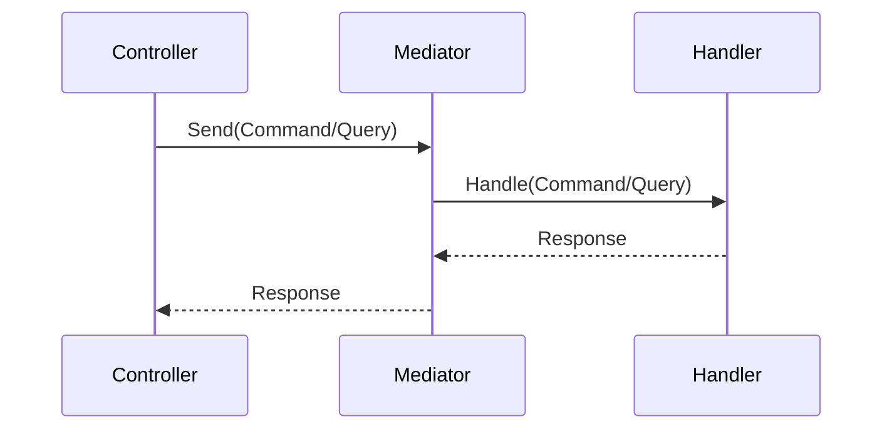
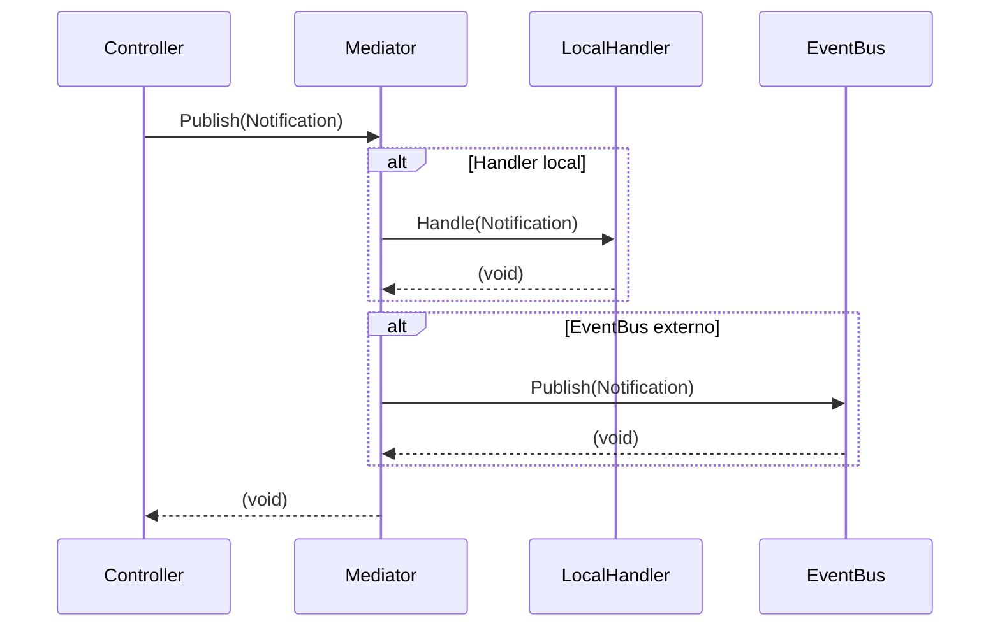

# Aurora.Mediator

Uma implementação simples e eficiente de Mediator para .NET, com mensagens in-process e sem dependências externas.

## Instalação

Adicione o pacote ao seu projeto via NuGet:

```powershell
dotnet add package Aurora.Mediator
```


## Como Usar

1. Importe o namespace:
    ```csharp
    using Aurora.Mediator;
    ```
2. Registre o Mediator no seu container de DI:
    ```csharp
    // Startup.cs ou Program.cs
    builder.Services.AddAuroraMediator(typeof(Program).Assembly);
    ```
3. Crie seus comandos, queries e notificações implementando as interfaces:
    - `IRequest<TResponse>`
    - `ICommand`
    - `INotification`
    - `IRequestHandler<TRequest, TResponse>`
    - `INotificationHandler<TNotification>`

4. Consuma o Mediator em uma Controller:
    ```csharp
    using Aurora.Mediator;

    [ApiController]
    [Route("api/[controller]")]
    public class UsersController : ControllerBase
    {
        private readonly IMediator _mediator;

        public UsersController(IMediator mediator)
        {
            _mediator = mediator;
        }

        [HttpPost]
        public async Task<IActionResult> Create(UserDto dto)
        {
            // Envia comando
            var result = await _mediator.Send(new CreateUserCommand(dto.Name, dto.Email));

            // Publica notificação
            await _mediator.Publish(new UserCreatedNotification(dto.Name, dto.Email));

            return Ok(result);
        }
    }
    ```

5. Envie comandos/queries:
    ```csharp
    var result = await mediator.Send(new MyCommand());
    ```

6. Publique notificações:
    ```csharp
    await mediator.Publish(new MyNotification());
    ```


## Diagramas

### Fluxo Mediator (Command/Query)



### Fluxo Notification



Veja exemplos completos na pasta `/src` e nos arquivos de teste.

### Uso de Notification

#### Cenário: UserCreatedNotification

```csharp
public record UserCreatedNotification(string Name, string Email) : INotification;
```

##### 1️⃣ Somente handler local

```csharp
public class LocalUserCreatedHandler : INotificationHandler<UserCreatedNotification>
{
    public Task Handle(UserCreatedNotification notification, CancellationToken cancellationToken)
    {
        Console.WriteLine($"[LOCAL HANDLER] Usuário criado: {notification.Name}");
        // Pode executar lógica interna: log, cache, email interno
        return Task.CompletedTask;
    }
}

// Registro DI
builder.Services.AddAuroraMediator(typeof(Program).Assembly);

// Publicação
await _mediator.Publish(new UserCreatedNotification("Rafael", "rafael@bd.com"));
```

**Resultado:**

`_mediator.Publish` chama apenas o handler local. Nenhum envio para EventBus externo.

##### 2️⃣ Somente IEventBus (sem handler local)

```csharp
public class AzureServiceBusEventBus : IEventBus
{
    private readonly ServiceBusClient _client;

    public AzureServiceBusEventBus(ServiceBusClient client)
    {
        _client = client;
    }

    public async Task PublishAsync<TNotification>(TNotification notification, CancellationToken cancellationToken = default)
        where TNotification : INotification
    {
        var sender = _client.CreateSender(typeof(TNotification).Name);
        var message = new ServiceBusMessage(JsonSerializer.Serialize(notification));
        await sender.SendMessageAsync(message, cancellationToken);
        Console.WriteLine($"[EVENT BUS] Notificação publicada: {typeof(TNotification).Name}");
    }
}

// Registro DI
builder.Services.AddSingleton<IEventBus, AzureServiceBusEventBus>();
builder.Services.AddAuroraMediator(typeof(Program).Assembly);

// Publicação
await _mediator.Publish(new UserCreatedNotification("Rafael", "rafael@bd.com"));
```

**Resultado:**

Não existe handler local. Mediator envia direto para o EventBus externo.

##### 3️⃣ Handler local + IEventBus

```csharp
// Handler local
public class LocalAndBusUserCreatedHandler : INotificationHandler<UserCreatedNotification>
{
    public Task Handle(UserCreatedNotification notification, CancellationToken cancellationToken)
    {
        Console.WriteLine($"[LOCAL HANDLER] Usuário criado: {notification.Name}");
        return Task.CompletedTask;
    }
}

// EventBus
public class AzureServiceBusEventBus : IEventBus
{
    private readonly ServiceBusClient _client;

    public AzureServiceBusEventBus(ServiceBusClient client) => _client = client;

    public async Task PublishAsync<TNotification>(TNotification notification, CancellationToken cancellationToken = default)
        where TNotification : INotification
    {
        var sender = _client.CreateSender(typeof(TNotification).Name);
        var message = new ServiceBusMessage(JsonSerializer.Serialize(notification));
        await sender.SendMessageAsync(message, cancellationToken);
        Console.WriteLine($"[EVENT BUS] Notificação publicada: {typeof(TNotification).Name}");
    }
}

// Registro DI
builder.Services.AddSingleton<IEventBus, AzureServiceBusEventBus>();
builder.Services.AddAuroraMediator(typeof(Program).Assembly);

// Publicação
await _mediator.Publish(new UserCreatedNotification("Rafael", "rafael@bd.com"));
```

**Resultado:**

Mediator chama handlers locais primeiro, depois envia para EventBus externo. Pode executar log, cache ou outras ações internas junto com o envio para broker.

### Behaviors Examples

#### LoggingBehavior

```csharp
using Aurora.Mediator;

namespace Aurora.Mediator.Behaviors;

public class LoggingBehavior<TRequest, TResponse> : IPipelineBehavior<TRequest, TResponse>
	where TRequest : IRequest<TResponse>
{
	public async Task<TResponse> Handle(TRequest request, CancellationToken cancellationToken, RequestHandlerDelegate<TResponse> next)
	{
		Console.WriteLine($"[LOG] Started {typeof(TRequest).Name}");
		var response = await next();
		Console.WriteLine($"[LOG] Ended {typeof(TRequest).Name}");
		return response;
	}
}
```

#### ValidationBehavior

```csharp
using Aurora.Mediator;

namespace Aurora.Mediator.Behaviors
{
    public class ValidationBehavior<TRequest, TResponse> : IPipelineBehavior<TRequest, TResponse>
        where TRequest : IRequest<TResponse>
    {
        private readonly IEnumerable<IValidator<TRequest>> _validators;

        public ValidationBehavior(IEnumerable<IValidator<TRequest>> validators)
        {
            _validators = validators;
        }

        public Task<TResponse> Handle(TRequest request, CancellationToken cancellationToken, RequestHandlerDelegate<TResponse> next)
        {
             if (_validators.Any())
            {
                var context = new ValidationContext<TRequest>(request);
                var failures = (await Task.WhenAll(
                        _validators.Select(v => v.ValidateAsync(context, cancellationToken))))
                    .SelectMany(result => result.Errors)
                    .Where(f => f != null)
                    .ToList();

                if (failures.Count != 0)
                {
                    throw new ValidationException(failures);
                }
            }

            return await next();
        }
    }
}
```

## Licença

Este projeto está sob a licença MIT. Veja o arquivo LICENSE para mais detalhes.
